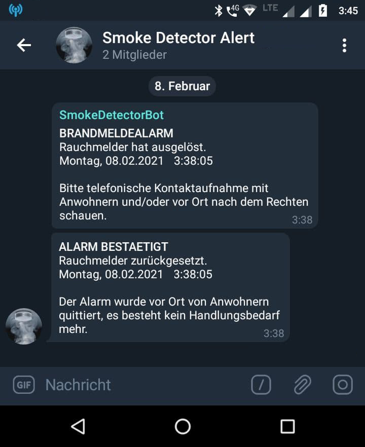
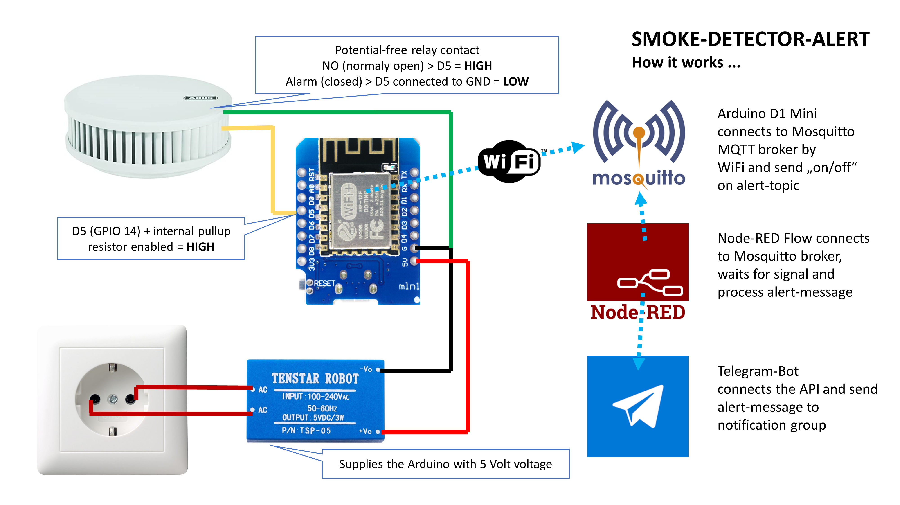
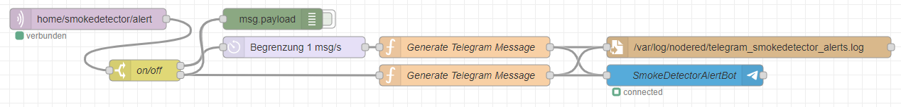

# SMOKE DETECTOR ALERT

Tapping of a potential-free relay contact of a smoke detector, alarm via MQTT and finally Telegram notification

> **⚠ WARNING, IMPORTANT NOTICE BEFORE USE**  
> I do not use this project myself, even if it sounds funny. Actually, when replacing the existing smoke detectors after 10 years, it should be radio-networked EI Electronics Ei650RF smoke detectors, which signal an alarm via the relay module Ei428 and are polled by an Arduino. What was initially the solution, has presented itself in the procurement as an unsolvable problem, since the specialized trade could not supply this product with factory-installed battery, the offered Ei650iW + radio module with 11 detectors would have blown up the cost frame. In the end, I decided to use a Z-Wave solution from a competitor, but I would still like to make this project and its code available to the community.

<!-- TOC -->

- [SMOKE DETECTOR ALERT](#smoke-detector-alert)
    - [FEATURES](#features)
    - [REQUIREMENTS](#requirements)
    - [INSTALL AND USAGE](#install-and-usage)
        - [PINOUT](#pinout)
        - [LIBRARIES](#libraries)
    - [DIRECTORIES AND FILES](#directories-and-files)
    - [AUTOMATION WITH NODE-RED](#automation-with-node-red)
        - [NODE-RED FLOW](#node-red-flow)
        - [MQTT TOPICS](#mqtt-topics)
    - [LICENSE](#license)

<!-- /TOC -->

## FEATURES

- Connects to the Wireless Access Point / Wifi Router
- Securely connects to the MQTT Broker (TLS)
- Controls ESP8266 Chip Level Data Pins
- Sends a heartbeat signal to the MQTT broker periodically
- Taps the potential-free relay contact when an alarm is triggered and sends a signal to a GPIO of the Arduino
- Sends the relay status via MQTT to the broker (on/off)

## REQUIREMENTS

- A smoke detector relay module
- Wemos D1 Mini (should work with other Arduino microcontrollers using a WiFi module too)
- WiFi infrastructure and Internet connection
- Visual Studio Code + PlatformIO or Arduino IDE (for Arduino IDE you have to move files from /src to root-folder)
- MQTT Broker such as the Mosquitto MQTT Broker (https://mosquitto.org/)
- A Node-RED instance to process the MQTT messages, generate alarms and send the alarm messages to Telegram
- Telegram Account and App from the Appstore https://play.google.com/store/apps/details?id=org.telegram.messenger&hl=en
- Some time to study the API https://core.telegram.org/

Note: It is certainly also possible to send Telegram messages directly from the Arduino. In this case, the infrastructure components Mosquitto and Node-RED are not required. However, this is not part of this project.

## INSTALL AND USAGE

- Downloading the repository
- Importing the SmokeDetectorAlert.ino file into the development environment
- Flashing an Arduino D1 Mini

### PINOUT

| Arduino-PIN | Description | Target
| --- | --- | --- | 
| 5V | Supply voltage | Connected to Tenstar 5V power supply (+Vo) |
| G (GND) | Supply voltage | Connected to Tenstar 5V power supply (-Vo) |
| D5 | Defined as input with pullup - so you dont need an external resistor | Connected to either relay contact of the smoke detector |
| G (GND) | Pulls the D5 GPIO from HIGH to LOW when the relay contact is closed | Connected to either relay contact of the smoke detector |

> **⚠ Note**  
> This diagram is only exemplary, it should be in the implementation of a real relay module that opens only in case of alarm. If you try to tap a smoke detector directly, e.g. via the piezzo, you should be aware that it not only emits pulses when there is an alarm, but also when the battery is empty, other detectors in the group have a problem, connectivity is no longer available, and much more. This would of course need to be included in the logic of code and intercepted.

### LIBRARIES ###

- PubSubClient by Nick O'Leary
- esp8266_mdns by Dunk

## DIRECTORIES AND FILES

- src/SmokeDetectorAlert.ino - The main programm code
- src/config.h - GPIO configuration, definition of threshold values, etc.
- src/credentials.h.sample - Sample configuration file for WiFi and MQTT credentials (please rename to credentials.h)
- README.md - The manual for this Arduino Script
- LICENSE - The license notes for this Arduino script
- platformio.ini - Wemos D1 Mini Configuration for PlatformIO

## AUTOMATION WITH NODE-RED

### NODE-RED FLOW

Node-RED works with so-called flows, which can be imported and exported. 
An example of a flow can be found in **flows.json** in this github repository.

### MQTT TOPICS

| MQTT Topic | Description | Possible values |
| --- | --- | --- |
| home/smokedetector/alert | Status of the potential-free relay contact (sends on when the smoke detector is triggered) | on, off |
| home/smokedetector/heartbeat | Heartbeat for troubleshooting and availability monitoring | on |

## LICENSE

smoke-detector-alert and all individual scripts are under the BSD 3-Clause license unless explicitly noted otherwise. Please refer to the LICENSE